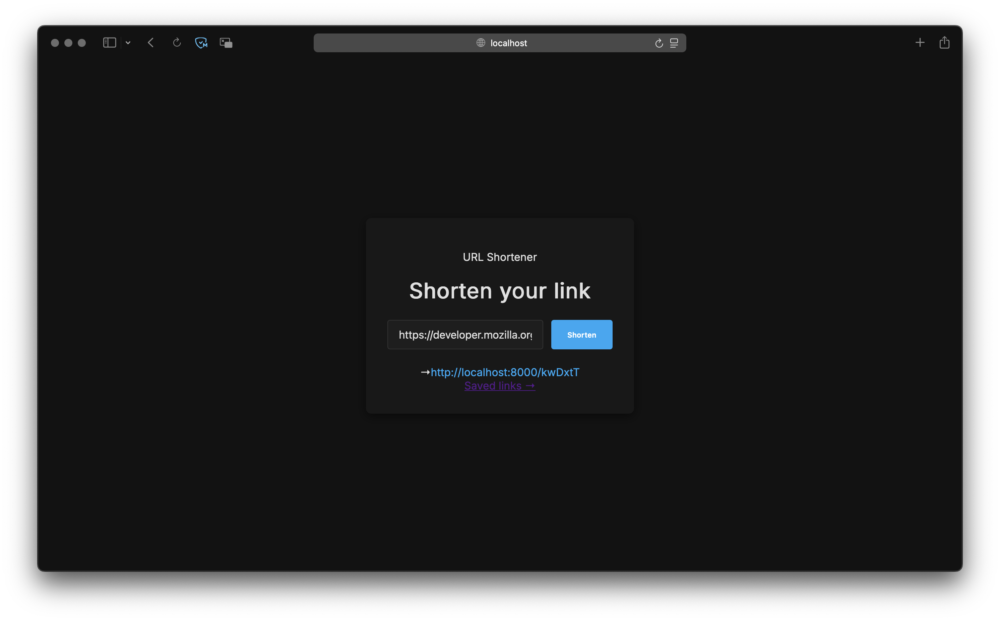
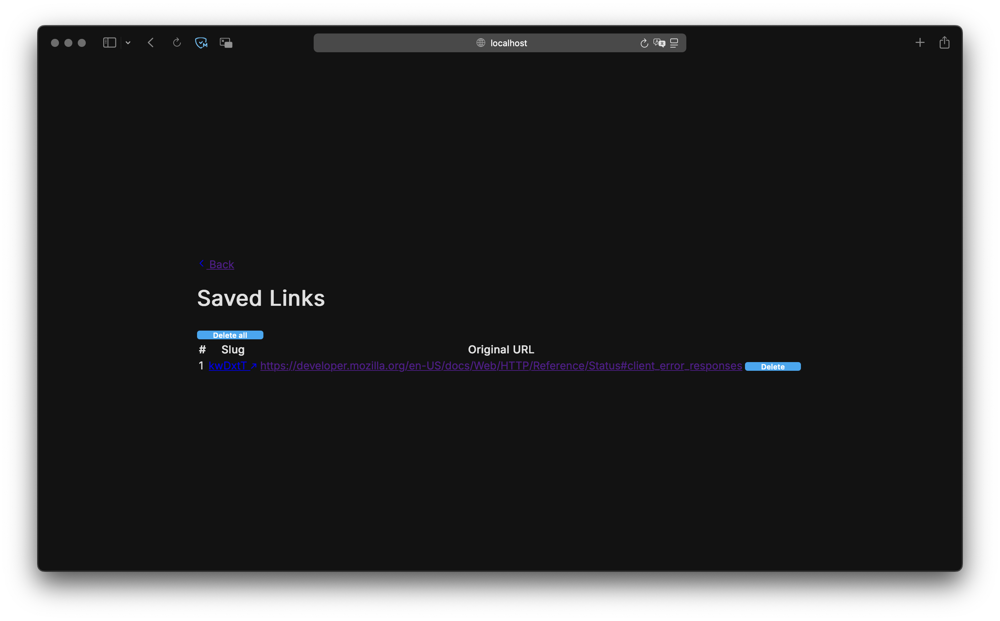

# URL Shortener

A web service for shortening long URLs, built with FastAPI backend and a simple HTML/CSS/JavaScript frontend. The service uses PostgreSQL as the database and is containerized with Docker for easy deployment.

## Features

- Shorten long URLs into compact slugs
- Redirect to original URLs using the generated slugs
- View all saved slug/URL pairs on a dedicated page
- Delete individual slugs or clear all at once via the web interface
- RESTful API for URL shortening
- Web interface for easy URL shortening
- Docker containerization for seamless deployment
- Comprehensive test suite

## Prerequisites

- Docker
- Docker Compose

## Installation and Launch

1. Clone the repository:
   ```bash
   git clone https://github.com/njituew/url_shortener.git
   cd url_shortener
   ```

2. Start the services using Docker Compose:
   ```bash
   docker-compose up --build
   ```

   This will start:
   - PostgreSQL database on port 6432
   - Backend API on port 8000
   - Frontend on port 3000

3. Open your browser and navigate to `http://localhost:3000` to access the web interface.

## Usage

### Web Interface

#### Main page (`index.html`)
1. Open `http://localhost:3000` in your browser
2. Enter a long URL in the input field
3. Click "Shorten"
4. Copy the generated short URL




#### Saved links page (`saved_slugs.html`)
1. Navigate to `http://localhost:3000/saved_slugs.html` or click the "Saved links" link on the main page
2. View a table of all saved slug/URL pairs
3. Click a slug to follow the short URL
4. Delete individual entries using the "Delete" button next to each row
5. Delete all saved links at once using the "Delete all" button



### API Usage

The API provides endpoints for programmatic access:

#### Shorten a URL

```bash
curl -X POST "http://localhost:8000/slug" \
     -H "Content-Type: application/json" \
     -d '{"original_url": "https://example.com"}'
```

Response:
```json
{
  "slug": "abc123",
  "original_url": "https://example.com"
}
```

#### Redirect to Original URL

```bash
curl -L "http://localhost:8000/abc123"
```

This will redirect to the original URL.

#### Get All Saved URLs

```bash
curl "http://localhost:8000/slugs"
```

Response:
```json
[
  {"slug": "abc123", "original_url": "https://example.com"},
  {"slug": "xyz789", "original_url": "https://another.com"}
]
```

#### Delete a Specific Slug

```bash
curl -X DELETE "http://localhost:8000/slugs/abc123"
```

#### Clear All URLs

```bash
curl -X DELETE "http://localhost:8000/slugs"
```

## API Endpoints

- `POST /slug` - Create a short URL
  - Body: `{"original_url": "string"}`
  - Response: `{"slug": "string", "original_url": "string"}`

- `GET /{slug}` - Redirect to original URL
  - Response: 302 redirect to original URL

- `GET /slugs` - Get all saved slug/URL pairs
  - Response: `[{"slug": "string", "original_url": "string"}]`

- `DELETE /slugs/{slug}` - Delete a specific slug
  - Response: `{"message": "string"}`

- `DELETE /slugs` - Clear all URL pairs

## Testing

Run tests locally (requires Python and dependencies):

```bash
python -m venv venv
source venv/bin/activate    # macOS, Linux
pip install -r requirements.txt
pytest
```

## Project Structure

```
url_shortener/
├── backend/
│   ├── main.py              # FastAPI application
│   ├── db/
│   │   ├── models.py        # SQLAlchemy models
│   │   ├── database.py      # Database configuration
│   │   └── crud.py          # Database operations
│   └── src/
│       ├── service.py       # Business logic
│       ├── short_url.py     # Slug generation
│       ├── url_validator.py # URL validation
│       ├── exception.py     # Custom exceptions
│       ├── dependencies.py  # FastAPI dependencies
│       └── lifespan.py      # Application lifespan events
├── frontend/
│   ├── index.html           # Main page
│   ├── saved_slugs.html     # Saved slugs list page
│   ├── saved_slugs.js       # Saved slugs page logic
│   ├── script.js            # Main page logic
│   └── style.css            # Styles
├── tests/                   # Test files
├── docker-compose.yml       # Docker Compose configuration
├── Dockerfile.backend       # Backend container
├── Dockerfile.frontend      # Frontend container
├── requirements.txt         # Python dependencies
└── README.md
```

## License

This project is licensed under the MIT License - see the [LICENSE](LICENSE) file for details.
